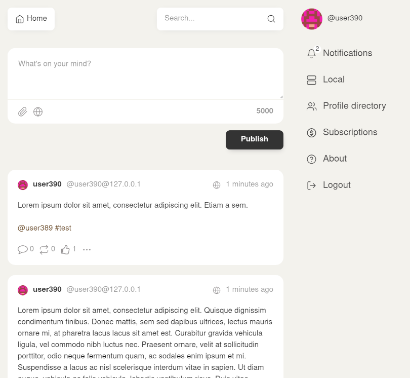

# Mitra Web

Default frontend for [Mitra](https://codeberg.org/silverpill/mitra).



Mitra Web UI includes a dark mode feature for visual accessibility.

## Compatibility

The latest version of Mitra Web UI is compatible with the latest version of Mitra server and the version before it.

Compatibility with previous versions is not guaranteed.

## Requirements

- node 16, 18
- npm 7+

## Project setup

```
npm install --no-save
npx allow-scripts
```

### Compile and minify for production

Set backend URL:

```
echo "VITE_BACKEND_URL=https://mydomain.tld" > .env.local
```

Or un-set it if both frontend and backend will run on the same URL:

```
echo "VITE_BACKEND_URL=" > .env.local
```

Compile:

```
npm run build
```

This will produce a static website in the `/dist` directory.

## Development

### Compiles and hot-reloads for development

```
npm start
```

### Run your unit tests

```
npm run test
```

### Lint files

```
npm run lint
```
