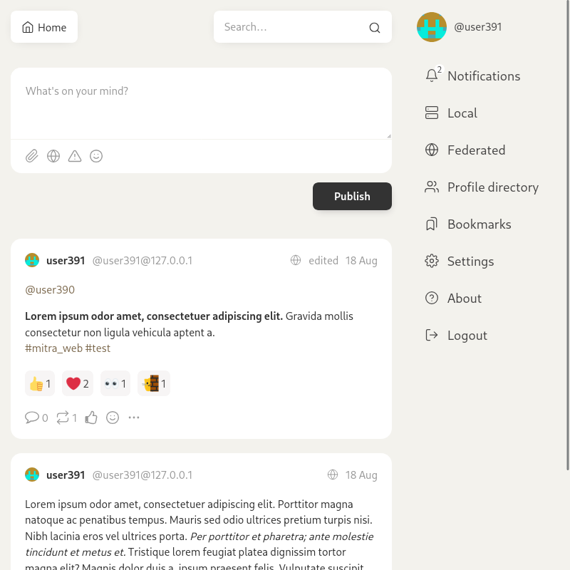

# Mitra Web

Default frontend for [Mitra](https://codeberg.org/silverpill/mitra).



## Requirements

- node 12 or 14
- npm 7+

## Project setup

```
npm install --no-save
npx allow-scripts
```

### Compile and minify for production

Set backend URL:

```
echo "VUE_APP_BACKEND_URL=https://mydomain.tld" > .env.local
```

Or un-set it if both frontend and backend will run on the same URL:

```
echo "VUE_APP_BACKEND_URL=" > .env.local
```

Compile:

```
npm run build
```

## Development

### Compiles and hot-reloads for development

```
npm start
```

### Run your unit tests

```
npm run test
```

### Lint files

```
npm run lint
```
